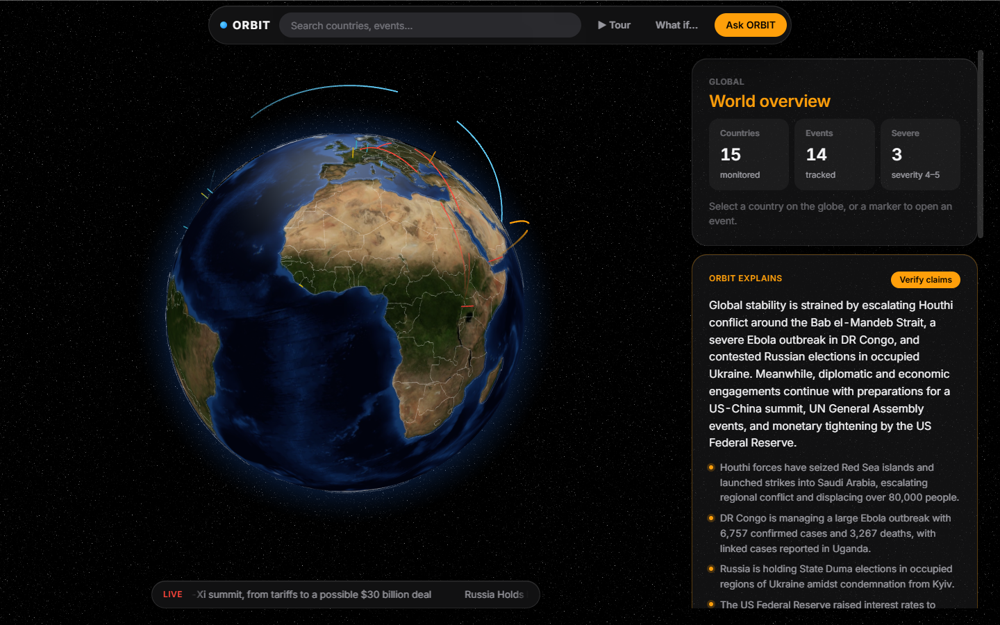

# ORBIT

AI-powered global intelligence on an interactive 3D globe: geopolitical and health signals, news, history,
markets, weather and explainable, multi-model-verified AI, in one flow: **Global → Country → Event → Explanation → Ask ORBIT**.



## What makes ORBIT different

| Feature                             | What it does                                                                                                                                                                                                                                 |
| ----------------------------------- | -------------------------------------------------------------------------------------------------------------------------------------------------------------------------------------------------------------------------------------------- |
| **Ripple effects**                  | Shows how an event spreads: Red Sea crisis → Brent crude → India's crude import bill → the rupee and pump prices. Each link is sourced or labelled "ORBIT analysis", has a live market figure, and is drawn as an animated arc on the globe. |
| **What if… simulator**              | `/simulate`: close the Strait of Hormuz or Bab el-Mandeb, choose an oil-price shock (−30…+100%), and ORBIT computes the knock-on effects with visible formulas on live and sourced numbers. Labelled "Simulation, not a forecast".           |
| **Multi-model claim check**         | Every AI explanation is split into claims. Gemini, Groq (gpt-oss-120b) and a deterministic rule checker verify each claim against ORBIT's data independently, and the UI shows where they agree or disagree.                                 |
| **Guided tour with a narrator**     | `▶ Tour` (or `/?tour=1`): the globe flies through the most severe events and the strongest ripple chain while a Gemini voice narrates. Narration is built from sourced data only. Keys: ← → move, space pause, M mute, Esc exit.             |
| **Voice in Ask ORBIT**              | 🎙 ask by voice (Chrome/Edge) and 🔊 Listen to any answer.                                                                                                                                                                                    |
| **Grounded AI**                     | Gemini answers only from ORBIT's data, cites source IDs, flags analysis and simulations, and falls back to cached insights, then to an offline analyser. It never shows a blank screen.                                                      |
| **Automatic event detection**       | ORBIT reads today's live headlines, proposes new events itself and marks them auto-detected and unverified, separate from the curated ones. See [docs/AUTO_EVENTS.md](docs/AUTO_EVENTS.md).                                                  |
| **Live, free data**                 | GDELT news, Yahoo Finance markets (Brent, USD/INR, NIFTY, Sensex, Indian blue chips), Open-Meteo weather. Every source is free and keyless, and every value is cached and has a seeded fallback for offline demos.                           |
| **Realistic Earth, Apple-style UI** | NASA Blue Marble textures, terrain, shiny oceans and stars; frosted-glass panels, capsule toolbar, SF typography.                                                                                                                            |

All of it runs on free tiers ($0) and still works with the wifi off.

Built in 24 hours by Arham, Ayman, Affan, Shrey and Hardik. This README is the team's starting point, and each section
links to the document that holds the full detail.

## Quick start

Requirements: **Node 22.12+** (team uses 24; see `.nvmrc`), npm, Git. Keep the repo **outside OneDrive** (e.g. `C:\dev\orbit`).

```powershell
git clone https://github.com/Ayman-Alam-India/orbit C:\dev\orbit
cd C:\dev\orbit
npm install
copy .env.example .env    # optional: every value has a safe default
npm run dev               # open http://localhost:5173
```

`npm run dev` starts two processes, `[web]` (Vite on :5173) and `[server]` (the API on :8787). The browser calls `/api/...`
and Vite forwards it to the API server. Everything works offline with mock data and a mock AI.

## Commands

| Command                               | What it does                                                                  |
| ------------------------------------- | ----------------------------------------------------------------------------- |
| `npm run dev`                         | Web + API servers with hot reload                                             |
| `npm run dev:web` / `npm run dev:api` | Only one of them                                                              |
| `npm test` / `npm run test:watch`     | Vitest: contracts, seed data, API, frontend, tasks.json                       |
| `npm run lint`                        | ESLint                                                                        |
| `npm run build`                       | Typecheck everything (`tsc -b`) + production frontend build                   |
| `npm run check`                       | **lint + test + build. Must pass before every PR**                            |
| `npm run format`                      | Prettier                                                                      |
| `npm run docs:pdf`                    | Rebuild `docs/ORBIT-Playbook.pdf` and `docs/ORBIT-Review.pdf`                 |
| `npm run warm:voice`                  | Pre-generate the tour narration (dev server running). **Run before the demo** |

## Architecture

```
Browser (React + 3D globe) ──/api──► Express API server ──► seed JSON (always) + live sources (cached) + AI (or mock)
                 └──────────── shared/ Zod contracts used by both sides ────────────┘
```

- **Frontend** (`src/`): Vite, React 19, TypeScript, react-globe.gl, TanStack Query, Zustand, CSS Modules + design tokens.
- **API** (`server/`): Express 5 run with tsx. It validates the seed data at startup, keeps keys server-side, and falls back to cache or seed when live data fails.
- **Contracts** (`shared/`): one Zod schema per entity (Country, OrbitEvent, NewsHeadline, Source, TimelineEvent, AIInsight,
  Ask, VerificationReport, ImpactLink, MarketQuote, WeatherReport, Scenario/SimulationResult).
- **AI** (`server/ai/`): Gemini via the Vercel AI SDK (model fallback list) with structured output. Insights are cached,
  and when Gemini fails ORBIT uses the cache, then the offline analyser. Claim verification: Gemini + Groq + rules
  (`server/ai/verify/`). Narrator voice: Gemini TTS, cached as WAV (`server/ai/tts.ts`).
- **Live sources** (`server/sources/`): GDELT (throttled queue), Yahoo Finance (refreshed every 15 min), Open-Meteo
  (cached 30 min). All go through the disk cache in `server/.cache/`.
- **Simulator** (`server/sim/simulate.ts`): a pure, unit-tested engine. Every output carries its formula and sources.

Details: [docs/PLAYBOOK.md](docs/PLAYBOOK.md#2-architecture).

## Repository structure

```
shared/          Contracts (schemas + API routes)        server/        API server, seed data, AI, live sources
src/             Frontend (layout, globe, features, ui)  public/data/   Country shapes for the globe
docs/            Team documentation + PDF                scripts/       Tooling
tasks.json       Task manifest                           AGENTS.md      Rules for people and coding agents
mcp/, workshop-data/   Hackathon organiser tooling: do not modify
```

Full map: [docs/PLAYBOOK.md](docs/PLAYBOOK.md#4-repository-map).

## Shared contracts

Types come only from `@shared` (`import { type Country, API_ROUTES } from '@shared'`).

| Rule        | Value                                                                  |
| ----------- | ---------------------------------------------------------------------- |
| Country IDs | ISO alpha-3, uppercase: `IND`                                          |
| Other IDs   | Prefix + lowercase slug: `evt_`, `hs_`, `news_`, `src_`, `tl_`, `ins_` |
| Dates       | ISO 8601 UTC: `2026-09-19T10:00:00Z`                                   |
| Coordinates | `{ lat, lng }`                                                         |
| Severity    | Integer 1–5                                                            |
| Responses   | `{ data }` or `{ error: { code, message } }`                           |

API routes, entity fields and the mock-data format: [docs/API.md](docs/API.md).

## Environment variables

Defined in `.env.example` (committed) and parsed in `server/env.ts`. Put real values in a local `.env`, which is never committed.

| Variable                       | Default                                                     | Meaning                                                                                                  |
| ------------------------------ | ----------------------------------------------------------- | -------------------------------------------------------------------------------------------------------- |
| `PORT`                         | `8787`                                                      | API server port                                                                                          |
| `DATA_MODE`                    | `mock`                                                      | `mock` = seed data only, offline · `live` = + live news, markets and weather (**use live for the demo**) |
| `AI_PROVIDER`                  | `mock`                                                      | `mock` or `google`                                                                                       |
| `GOOGLE_GENERATIVE_AI_API_KEY` | empty                                                       | Gemini key, only in your local `.env`                                                                    |
| `GOOGLE_MODEL`                 | `gemini-3.5-flash,gemini-3.5-flash-lite`                    | Gemini model(s), tried in order                                                                          |
| `GROQ_API_KEY`                 | empty                                                       | Groq key (free tier): the second model for claim verification                                            |
| `GROQ_MODEL`                   | `openai/gpt-oss-120b`                                       | Groq model used for verification                                                                         |
| `GOOGLE_TTS_MODEL`             | `gemini-3.1-flash-tts-preview,gemini-2.5-flash-preview-tts` | Narrator voice model(s), tried in order. No key = the browser's voice                                    |
| `GOOGLE_TTS_VOICE`             | `Charon`                                                    | Gemini prebuilt voice (Charon, Kore, Puck, Aoede…)                                                       |

Secrets never go in code, commits, chat, or `VITE_` variables.

## Team and ownership

**Build model:** Claude, running in Ayman's session, writes all the code. Each teammate is the **decision owner** for an area:
Claude asks them the customization questions (layout, content, wording, interactions, data) before building, and they review
and test the result. Teammates don't commit code; they comment on PRs or post in the chat. See [AGENTS.md](AGENTS.md#0-build-model-one-code-writer).

| Person              | Decides and reviews                                          |
| ------------------- | ------------------------------------------------------------ |
| Hardik (integrator) | Reviews and merges every PR, sync points, the demo laptop    |
| Affan               | AI behaviour and tone (provides the AI key)                  |
| Arham               | Visual direction, layout, globe look                         |
| Ayman               | Drives the Claude session; country, event and timeline views |
| Shrey               | Featured countries and events, fact checks, demo rehearsal   |

The folder-to-owner map and the shared files that need a separate PR are in [AGENTS.md](AGENTS.md#3-folder-ownership-decision-owners).

## Task system

All work is listed in [`tasks.json`](tasks.json): ID, owner, priority, branch, allowed paths, dependencies, acceptance criteria,
tests and handoff. To find out what to do, paste the prompt from [docs/ALLOCATOR.md](docs/ALLOCATOR.md) into your LLM
with your name. Explanation of the fields and the dependency graph: [docs/PLAYBOOK.md](docs/PLAYBOOK.md#10-task-system).

## Git workflow

1. `git checkout main && git pull`, then `git checkout -b <branch from tasks.json>`
2. Small commits: `area: what changed`
3. `git pull origin main` and `npm run check`
4. PR titled `[ORB-XXX-NN] summary`. Hardik squash-merges.

Contract changes, conflicts and what never gets committed: [docs/INTEGRATION.md](docs/INTEGRATION.md).

## Documentation

| Document                                                                                | For                                                                      |
| --------------------------------------------------------------------------------------- | ------------------------------------------------------------------------ |
| [AGENTS.md](AGENTS.md)                                                                  | Rules (read by Claude Code via `CLAUDE.md`, Codex, Cursor)               |
| [docs/PLAYBOOK.md](docs/PLAYBOOK.md)                                                    | Everything in one place                                                  |
| [docs/API.md](docs/API.md)                                                              | API and data contract                                                    |
| [docs/INTEGRATION.md](docs/INTEGRATION.md)                                              | Branches, PRs, contract changes                                          |
| [docs/DESIGN_SYSTEM.md](docs/DESIGN_SYSTEM.md)                                          | Tokens, primitives, UI conventions                                       |
| [docs/ALLOCATOR.md](docs/ALLOCATOR.md)                                                  | Personal LLM task allocator                                              |
| [docs/ORBIT-Playbook.pdf](docs/ORBIT-Playbook.pdf)                                      | Printable reference (generated, the Markdown is the source)              |
| [docs/WALKTHROUGH.md](docs/WALKTHROUGH.md) · [docs/AUTO_EVENTS.md](docs/AUTO_EVENTS.md) | Explaining the code in a review, and how automatic detection works       |
| [docs/REVIEW.md](docs/REVIEW.md) · [PDF](docs/ORBIT-Review.pdf)                         | Review and judging prep: pitch, features, architecture, demo script, Q&A |

## Demo checklist

1. `.env` has `DATA_MODE=live`, `AI_PROVIDER=google`, the Gemini and Groq keys.
2. `npm run dev`, then `npm run warm:voice`. Open each featured country once so insights and claim checks are cached.
3. Use **Edge** in full screen. Start with `/?tour=1` and press ▶. Then Red Sea event → claim check → What if… Hormuz +30% → Ask ORBIT by voice.
4. If the wifi dies, keep going: the cached data, AI answers and narration still work.

## Credits

Country shapes: [Natural Earth](https://www.naturalearthdata.com/) 1:110m admin-0 countries (public domain), via the
globe.gl examples.
