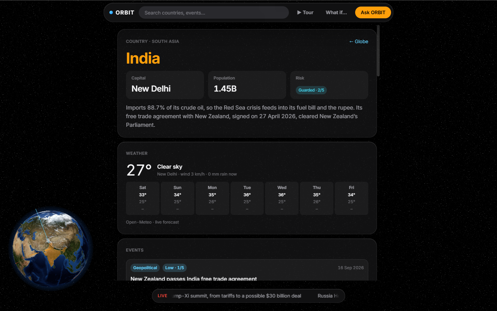
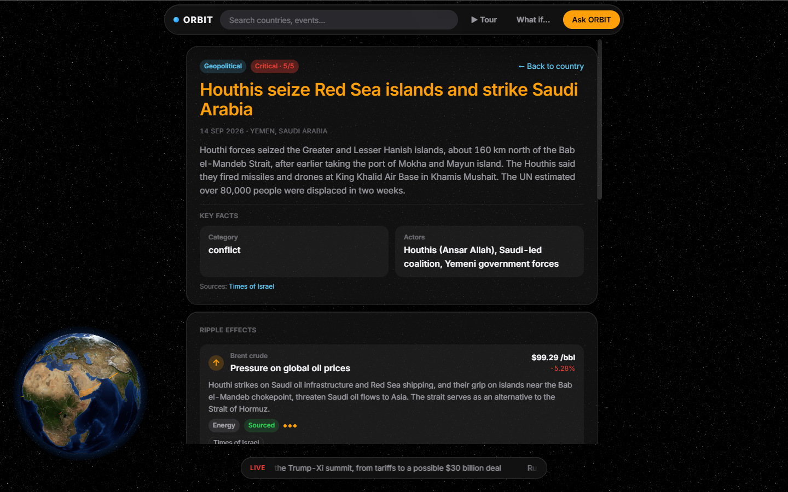
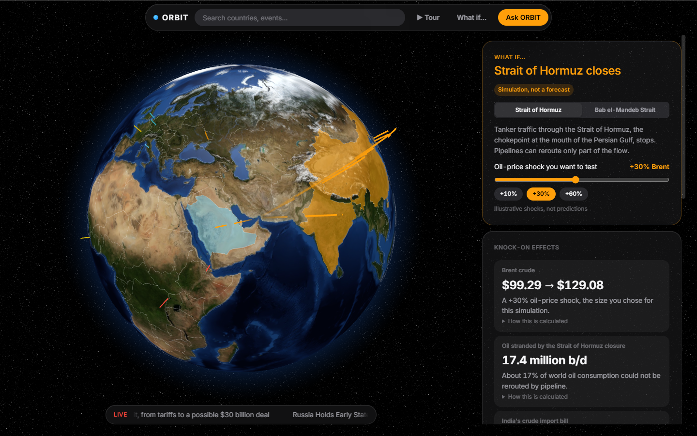
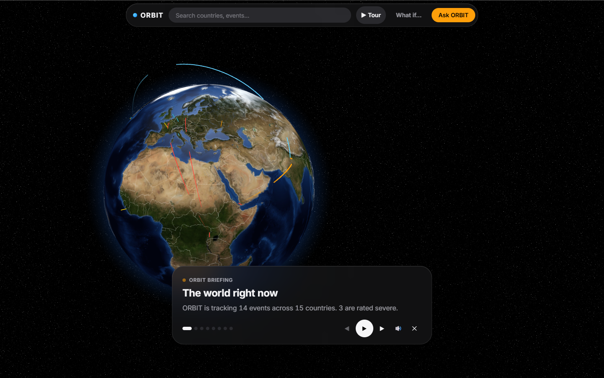

# ORBIT: review preparation

Everything you need for the review: what ORBIT is, what is special about it, how it works, how to demo it, and the
questions a reviewer is likely to ask, with the answers. Figures are from the running app on 19 Sep 2026.

---

## 1. The 30-second pitch

> **ORBIT is an AI global-intelligence platform on a 3D globe.** It turns scattered world events (conflicts, disease
> outbreaks, trade and policy moves) into one explorable picture: **Global → Country → Event → Explanation → Ask ORBIT**.
> Its edge is that it shows **how events ripple across the world** (a Red Sea attack → oil prices → India's import bill →
> the rupee and pump prices), lets you **simulate "what if"** (the Strait of Hormuz closes), and **checks its own AI with
> three independent verifiers**, so every claim is traceable to a source. It runs entirely on free services and keeps
> working with the wifi off.

**One-liner:** _"Google Earth meets a Bloomberg terminal, with an AI analyst that shows its sources and checks its own work."_

---

## 2. The problem

- World news is fragmented: a conflict, an outbreak and an oil-price move land in different apps and feeds.
- People see **events**, not **consequences**. The link from "Houthis seize Red Sea islands" to "petrol in Delhi" is
  invisible to most readers.
- AI summaries are fluent but **unverifiable**. Users can't tell sourced fact from model guesswork.

## 3. The solution

| Need                      | ORBIT's answer                                                                                                     |
| ------------------------- | ------------------------------------------------------------------------------------------------------------------ |
| See the world at a glance | A realistic 3D globe with severity-coloured event pins, pulsing rings on severe events, and a live headline ticker |
| Understand one place      | Country view: risk level, events, history timeline, live news, markets, weather, AI briefing                       |
| Understand one event      | Event view: summary, sources, ripple effects, AI explanation with a **claim-by-claim verification**                |
| See consequences          | **Ripple effects**: sourced cause → effect chains, drawn as animated arcs on the globe                             |
| Explore scenarios         | **What if… simulator**: chokepoint closures with transparent arithmetic                                            |
| Ask anything              | **Ask ORBIT**: a grounded chat that knows what you're looking at, by text or voice                                 |
| Present it                | **Guided tour**: the globe flies through the top stories with a natural narrator voice                             |

---

## 4. Feature walkthrough


### 4.1 Global view

- A realistic Earth: NASA Blue Marble texture, terrain bump map, specular (shiny) oceans, atmosphere, starfield. It
  rotates slowly when idle and pauses while you drag.
- **14 curated real events** from 15 countries (Sept 2026): 7 health (WHO, UKHSA NaTHNaC) and 7 geopolitical (Red Sea /
  Houthis, Russia's Duma vote in occupied Ukraine, the Trump–Xi summit, the Fed rate decision, the Thaçi verdict, the
  NZ–India FTA, UNGA81).
- Pins are coloured by severity (1–5). Severity 4–5 gets pulsing rings. Hover for a tooltip, click to open.
- **Ripple arcs**: animated arcs coloured by channel (energy, shipping, trade, finance, health, security).
- Right column: the AI world briefing, health signals, headline markets. A live headline ticker runs at the bottom.
- An Apple-style UI: frosted-glass panels, a capsule toolbar (search, ▶ Tour, What if…, Ask ORBIT), SF typography, rounded
  radii (8/14/22/28 px).



### 4.2 Country view (`/country/IND`)

- The globe shrinks into a mini globe (bottom-left) centred on the country. Click it to return to the world.
- Profile: capital, population, region, **risk level**, summary (e.g. India: 88.7% crude import dependence, from ThePrint).
- Events in and involving the country, a **history timeline** (key dates), **live news** (GDELT), **markets** (NIFTY 50, Sensex,
  Reliance, TCS, HDFC Bank, Infosys, USD/INR, Brent, Delhi petrol/diesel), with sparklines, **weather** for the capital
  (Open-Meteo), **ripple effects touching this country**, and an **AI country briefing**.



### 4.3 Event view and the AI explanation

- Event details, sources (each with publisher and reliability), and ripple effects caused by the event.
- **AI explanation** (Gemini): 2–3 sentence summary, key points, the sources used, and a confidence level.
- **Claim check** (our trust feature): the explanation is split into up to 6 claims, and each is checked
  **independently** by three verifiers:
  1. **Gemini** (Google): LLM judgement against ORBIT's data
  2. **Groq gpt-oss-120b** (a different model from a different company): an independent LLM judgement
  3. **Rules**: deterministic, no AI. Every number in the claim and most key terms must appear in ORBIT's data.
- Each claim shows supported / unsupported / contradicted per verifier, plus an **agreement** badge (agree / disagree)
  and an overall agreement score. In our live run: **6 of 6 claims, all three verifiers agreed.**

### 4.4 Ripple effects (USP #1)

- An `ImpactLink` connects an **event** to a **country or market**: channel (energy, shipping, trade, finance, health,
  security), direction (up / down / risk), strength 1–3, effect, mechanism, and **basis**:
  - `sourced`: the source states it
  - `analysis`: ORBIT's reasoning built on sourced facts, always **labelled "ORBIT analysis"** in the UI and by the AI.
- Links chain (`followsImpactId`): **Houthis seize Red Sea islands → Brent crude ↑ → India's crude import bill ↑ → rupee
  pressure / pump prices**. Each hop shows the live market value it touches (Brent $99.29, USD/INR 95.88, Delhi petrol ₹102.12/l).
- 10 curated links. On the globe they are animated arcs, and Ask ORBIT can explain them.



### 4.5 What if… simulator (USP #2)

- Scenarios: **Strait of Hormuz closes** and **Bab el-Mandeb shipping halts**. Each has sourced facts (U.S. EIA, Times of Israel).
- **The user chooses the oil-price shock** (slider −30% to +100%, presets +10/+30/+60, marked illustrative). ORBIT
  **does not predict the shock**. It only does transparent arithmetic on live and sourced numbers.
- Every result card has a **"How this is calculated"** formula and source chips. A permanent badge reads **"Simulation,
  not a forecast"**.
- The globe flies to the chokepoint. Affected countries are tinted by role (importer orange, exporter cyan, transit red),
  and arcs run from the chokepoint to each importer.
- Ask ORBIT on this page knows the current simulation and always calls it a simulation.

**Worked example: Hormuz, +30%:**

| Output                        | Formula                                                    | Result                                                                                                 |
| ----------------------------- | ---------------------------------------------------------- | ------------------------------------------------------------------------------------------------------ |
| New Brent price               | live Brent × (1 + 30%) = 99.29 × 1.3                       | **$99.29 → $129.08**                                                                                   |
| Oil flow with no route out    | Hormuz flow − pipeline bypass = 20 − 2.6 million b/d (EIA) | **17.4 million b/d ≈ 17% of world use**                                                                |
| India crude import bill       | same volumes, price only                                   | **+30%**                                                                                               |
| Crude cost per litre in India | ΔBrent × USD/INR ÷ 158.987 l/bbl = 29.79 × 95.88 ÷ 158.987 | **up to +₹18.0/l** (if fully passed through, before taxes and subsidies; today's Delhi petrol ₹102.12) |
| Rupee pressure, market risk   | qualitative, from the ripple graph                         | labelled ORBIT analysis                                                                                |



### 4.6 Guided tour with a narrator (USP #3, the demo opener)

- `▶ Tour` in the toolbar, or open `/?tour=1`. Stops: intro → the 5 most severe events → the strongest ripple chain → outro.
- The camera makes a slow cinematic flight to each stop. Rotation pauses, the stop's country lights up, and the side
  panels fade away.
- Caption card: eyebrow, title, one-line briefing with its ripple line, progress dots, ‹ ▶/❚❚ › 🔊 ✕ and **Open** (jump
  into that event). Keys: ← → move, space pause, M mute, Esc exit.
- **Narrator voice: Gemini text-to-speech** (voice "Charon", directed as a calm documentary narrator). Clips are
  cached on disk, so each sentence is generated once, then plays instantly and offline. The next stop's clip is fetched
  while the current one plays. If there is no key or quota, the browser's own voice takes over.
- **Safety:** the narration text is built only from event summaries and sourced ripple links, never free AI text, so the
  tour cannot say anything unsourced.

### 4.7 Ask ORBIT (chat)

- A drawer on the right. It knows the context (world, country, event, or the current simulation) and offers suggested
  questions for it.
- Answers are grounded (see §6), cite source chips, and show which provider answered (Gemini / Offline analysis).
- **Voice:** 🎙 ask by voice (Chrome/Edge speech recognition; words appear as you speak and the question sends when you
  stop), and **🔊 Listen** reads any answer aloud in the narrator voice.

### 4.8 Search and navigation

- Search countries and events from the toolbar. The URL is the state (`/country/IND/event/...`), so every view can be
  linked and the back button works.

---

## 5. Architecture

```
┌──────────────────────── Browser (React 19 + TypeScript) ────────────────────────┐
│  3D globe (react-globe.gl / three.js) · views · Ask ORBIT · tour · simulator    │
│  TanStack Query (server data)  ·  Zustand (UI state)  ·  React Router (URL)     │
└───────────────────────────────┬─────────────────────────────────────────────────┘
                                │ /api/... (JSON envelope { data } | { error })
┌───────────────────────────────▼─────────────────────────────────────────────────┐
│  Express 5 API (Node 24, tsx)                                                   │
│  seed store (validated at startup) · live sources · AI · verifier · simulator   │
│  disk cache (server/.cache): news, markets, weather, insights, checks, voice    │
└──────┬───────────────┬──────────────┬──────────────┬───────────────┬────────────┘
       │               │              │              │               │
   GDELT news    Yahoo Finance    Open-Meteo    Gemini (text,    Groq (verifier)
   (free)        (free)           (free)        TTS) free tier   free tier
        └──────── shared/ : Zod contracts used by both sides ────────┘
```

**Why this design:**

- **One contract, both sides**: every entity is a Zod schema in `shared/`. The server validates seed data and AI output
  against it, and the frontend gets the types, so a mismatch fails at build time, not on stage.
- **Keys stay on the server**: the browser never sees an API key (no `VITE_` secrets).
- **Seed first, live on top**: curated, fact-checked data always exists. Live sources enrich it and are cached. Any
  failure falls back to cache, then to seed, so the screen is never blank.
- **The URL is the state**: views can be shared and linked, and back and forward work.

### Tech stack

| Layer      | Choice                                   | Why                                                       |
| ---------- | ---------------------------------------- | --------------------------------------------------------- |
| Frontend   | Vite 8, React 19, TypeScript (strict)    | Fast dev loop, the team knows React, types catch mistakes |
| Globe      | react-globe.gl (three.js / WebGL)        | Proven 3D globe with points, polygons, arcs and rings     |
| Data layer | TanStack Query · Zustand · React Router  | Caching and retries for free · tiny UI store · URL state  |
| Styling    | CSS Modules + design tokens              | No runtime cost, scoped styles, one place for colours     |
| API        | Express 5 on Node 24 via tsx             | Simple, TypeScript without a build step                   |
| Contracts  | Zod 4                                    | Runtime validation and static types from one definition   |
| AI         | Vercel AI SDK: Gemini (text + TTS), Groq | Structured output, provider-agnostic, free tiers          |
| Tests      | Vitest + Testing Library                 | Same config as Vite; tests the real API with fixtures     |

---

## 6. The AI, and why it can be trusted

1. **Grounding:** the model receives a compact JSON **context** (the countries, events, headlines, ripple links, markets
   and simulation relevant to the question) and strict rules: use only this context, cite source IDs exactly, say so
   when the context doesn't answer, label "ORBIT analysis", call simulations simulations, no speculation or advice.
2. **Structured output:** responses must match a Zod schema (summary, key points, sourceIds, confidence). Invalid
   output is rejected, and unknown source IDs are dropped.
3. **Independent verification:** Gemini + Groq + rules check every claim (§4.3). Disagreement is shown, not hidden.
4. **Model fallback:** Gemini 3.5 Flash → 3.5 Flash-Lite. On any failure: the cached insight → the offline analyser
   (clearly labelled "Offline analysis").
5. **Cost and quota discipline:** insights are reused for 30 minutes, verification reports and voice clips are cached,
   and requests are retried once.

---

## 7. Data sources (all free, $0)

| Source                                                                      | Used for                                             | Mode         |
| --------------------------------------------------------------------------- | ---------------------------------------------------- | ------------ |
| WHO Disease Outbreak News, UKHSA NaTHNaC                                    | Health events (Ebola DRC, dengue, West Nile, Lassa…) | Curated seed |
| Federal Reserve, UN, Al Jazeera, Kyiv Post, Euronews, LN24, Times of Israel | Geopolitical events                                  | Curated seed |
| U.S. EIA (Hormuz)                                                           | Simulator: 20 mb/d flow, 2.6 mb/d bypass             | Curated seed |
| ThePrint, Business Today, Goodreturns                                       | India crude dependence 88.7%, Delhi fuel prices      | Curated seed |
| World Bank WDI                                                              | Population, country metadata                         | Curated seed |
| **GDELT DOC 2.0**                                                           | Live news per country                                | Live, cached |
| **Yahoo Finance chart API**                                                 | Brent, USD/INR, NIFTY, Sensex, stocks (every 15 min) | Live, cached |
| **Open-Meteo**                                                              | Capital-city weather                                 | Live, cached |
| Natural Earth / NASA Blue Marble                                            | Country shapes, Earth textures                       | Static files |

17 sources in total. Each has a reliability rating, and every event, headline, link and market value points to one.

---

## 8. Reliability: it survives a live demo

- **Wifi off:** seed data plus the disk cache for news, markets, weather, insights, claim checks and voice clips. The
  demo keeps working. Where there's nothing cached, the UI says so plainly (e.g. "Weather is unavailable right now.").
- **API quota hit:** model fallback, then cache, then the offline analyser. The voice falls back to the browser's voice.
- **Rate limits:** GDELT requests are queued 10 s apart with a back-off, and refreshed in the background.
- **Startup validation:** bad seed data (a broken reference, wrong ID format) stops the server with a clear message.
- **Error boundaries** around the globe, each view, and Ask ORBIT: one failure never blanks the app.

## 9. Security and privacy

- API keys only in a local `.env` (gitignored), read on the server. Never in the frontend, commits or chat.
- All input is validated with Zod (IDs, query params, request bodies, text length limits).
- No user accounts and no personal data stored. Voice recognition runs in the browser.

## 10. Quality

- **123 automated tests** (25 files): contracts, seed-data integrity, every API route, AI grounding and fallbacks,
  verification, the simulator's arithmetic, the tour's stop order, voice UI (mocked), and frontend views.
- `npm run check` = lint + tests + typecheck + production build, required before every merge.
- Tests never touch real APIs or keys: they use fixtures, the mock AI and a temporary cache.

## 11. Team and process

| Person | Role                                                       |
| ------ | ---------------------------------------------------------- |
| Ayman  | Drove the build session; country, event and timeline views |
| Hardik | Integrator: reviews and merges PRs, demo laptop            |
| Affan  | AI behaviour and tone, API keys                            |
| Arham  | Visual direction, layout, globe look                       |
| Shrey  | Featured countries and events, fact checks, demo rehearsal |

We used an AI pair-programmer (Claude Code) to write the code, following a frozen architecture and contracts. Decisions
were owned by the team, work was split into a task manifest (`tasks.json`), and every change went through a PR with
tests. The docs (`README`, `docs/`) describe everything, so any teammate can run and explain it.

---

## 12. Demo script (about 5 minutes)

| Time | Do                                                                   | Say                                                                                                                                                                                   |
| ---- | -------------------------------------------------------------------- | ------------------------------------------------------------------------------------------------------------------------------------------------------------------------------------- |
| 0:00 | Open `localhost:5173/?tour=1`, press ▶                               | "This is ORBIT. Let it brief you." (let 2 stops play)                                                                                                                                 |
| 0:45 | At the Red Sea stop press **Open**                                   | "Every event comes with sources, and ORBIT shows what happens next."                                                                                                                  |
| 1:15 | Scroll to ripple effects, then the AI explanation → **Claim check**  | "Red Sea → Brent → India's import bill → the rupee. And the AI's claims are checked by three independent verifiers: Gemini, Groq, and a rule checker with no AI. They agree."         |
| 2:15 | Click **What if…** → Hormuz, press **+30%**                          | "What if Hormuz closes? You choose the shock, and ORBIT shows the maths: Brent to $129, 17 million barrels a day stranded, up to ₹18 a litre in India. A simulation, not a forecast." |
| 3:15 | Open **Ask ORBIT** → 🎙 "Why would India be hit hardest?" → 🔊 Listen | "Ask by voice. The answer cites its sources, and it can read it aloud."                                                                                                               |
| 4:00 | Click India on the globe                                             | "Every country: live markets, weather, news, history, and an AI briefing."                                                                                                            |
| 4:30 | Back to the globe                                                    | "All free data, all sourced, and it still works with the wifi off."                                                                                                                   |

**Before the demo:** `DATA_MODE=live`, keys in `.env`, `npm run dev`, `npm run warm:voice`, open India, the Red Sea
event and `/simulate` once (this caches them). Use Edge in full screen at 100% zoom, volume up.

**Backup plan:** if the internet fails, carry on: everything is cached. If the voice fails, press 🔊 to mute and narrate
yourself (captions still advance every 9 s).

---

## 13. Likely questions, with answers

**Q: Where does the data come from? Is it real?**
Yes. 14 curated events from Sept 2026 with 17 named sources (WHO, UKHSA, the Fed, EIA, Kyiv Post, Euronews…), plus
live GDELT news, Yahoo Finance markets and Open-Meteo weather. Every item links to its source.

**Q: How do you stop the AI hallucinating?**
Four layers: it only sees ORBIT's data (grounding), its output must match a schema with valid source IDs, three
independent verifiers check each claim, and ORBIT's own analysis is always labelled. If the AI fails, we show a
labelled offline analysis instead of guessing.

**Q: Why three verifiers?**
Two LLMs from different companies make different mistakes, so agreement between them means more. The rule-based checker
needs no AI and no internet: it proves the numbers are really in the data. Showing disagreement builds trust.

**Q: Is the simulator a prediction?**
No, and it says so. The user picks the price shock. ORBIT only does arithmetic on sourced facts (EIA volumes) and live
prices, and shows every formula. Qualitative effects are labelled as analysis.

**Q: If there is a new headline tomorrow, does ORBIT add it by itself?**
Yes. Headlines, markets and weather have always refreshed themselves from live APIs. Since Review 2,
events do too: ORBIT reads the live feed, classifies the headline, writes a one-sentence summary from
the headline text only, validates it against the event contract and adds it to the globe as
"auto-detected · unverified", kept separate from the curated events. "Scan now" runs it while you watch.
Details and guardrails: `docs/AUTO_EVENTS.md`.

**Q: How are ripple effects created? Could it scale?**
Today they are curated and sourced by the team, which keeps them accurate. The schema (event → target, channel, basis,
chain) is ready for AI-proposed links that are then verified by the same claim checker. That is the next step.

**Q: What does it cost to run?**
$0. Gemini and Groq free tiers, keyless public data APIs. Caching keeps us inside the free quotas.

**Q: What happens if the internet or an API goes down?**
The app keeps working from the seed data and the disk cache, and the AI falls back to cached or offline answers. We
tested this with the wifi off.

**Q: Why a 3D globe instead of a map?**
Global chains (Red Sea → India, Hormuz → East Asia) read naturally as arcs on a globe, and it makes geography intuitive.
The globe shrinks to a mini-globe in detail views so the content stays readable.

**Q: How is the narrator voice made?**
Gemini's text-to-speech model, directed to sound like a documentary narrator. Each sentence is generated once and cached,
so the tour plays instantly and offline. Its script comes only from sourced data.

**Q: Why TypeScript + Zod everywhere?**
One contract for both the frontend and the server, validated at runtime. With five people working in parallel over 24
hours, it catches mismatches before the demo does.

**Q: How did you split the work / use AI to build it?**
We froze the architecture and contracts first, split the work into a task manifest with owners and acceptance tests,
and used an AI pair-programmer for the implementation. Humans owned the decisions (design, data, AI tone, featured
events) and reviewed every PR. 111 tests guard it.

**Q: What would you build next?**
AI-proposed ripple links (verified before publishing), more scenarios (Suez, Malacca, Taiwan Strait), personalised alerts
("tell me when something affects my country or portfolio"), more countries and live event ingestion, and mobile.

**Q: What are the limitations?**
Events and ripple links are curated (15 countries, 14 events), not yet auto-ingested. Free-tier quotas limit heavy use
(caching mitigates this). Voice input needs Chrome or Edge. The simulator is deliberately simple arithmetic, not an
economic model.

---

## 14. Numbers cheat sheet

| Fact                                      | Value                                                                      |
| ----------------------------------------- | -------------------------------------------------------------------------- |
| Countries / events / sources              | 15 / 14 (7 health, 7 geopolitical) / 17                                    |
| Ripple links / market series / scenarios  | 10 / 10 / 2                                                                |
| Verifiers                                 | 3 (Gemini, Groq gpt-oss-120b, rules)                                       |
| AI models                                 | Gemini 3.5 Flash (+ Flash-Lite), Gemini 3.1 Flash TTS, Groq gpt-oss-120b   |
| Tests                                     | 111 across 25 files                                                        |
| Cost                                      | $0 (free tiers, keyless public APIs)                                       |
| Brent / USD-INR / Delhi petrol (snapshot) | $99.29 / ₹95.88 / ₹102.12 per litre                                        |
| Hormuz (EIA)                              | 20 mb/d ≈ 20% of world use; 2.6 mb/d bypass; 84% of its crude goes to Asia |
| India crude import dependence             | 88.7% (ThePrint, Jul 2026)                                                 |
| Hormuz +30% (simulation)                  | Brent $129.08 · 17.4 mb/d stranded · India bill +30% · up to +₹18.0/l      |

## 15. API at a glance

`GET /api/health` · `/countries` · `/countries/:id` · `/countries/:id/events` · `/countries/:id/timeline` · `/events` ·
`/events/:id` · `/news` · `/sources` · `/insights/:type/:id` · `/verify/:type/:id` · `/impacts` · `/markets` ·
`/weather/:countryId` · `/scenarios` · `/simulate` · `POST /ask` · `POST /speech`. Full contract: `docs/API.md`.
